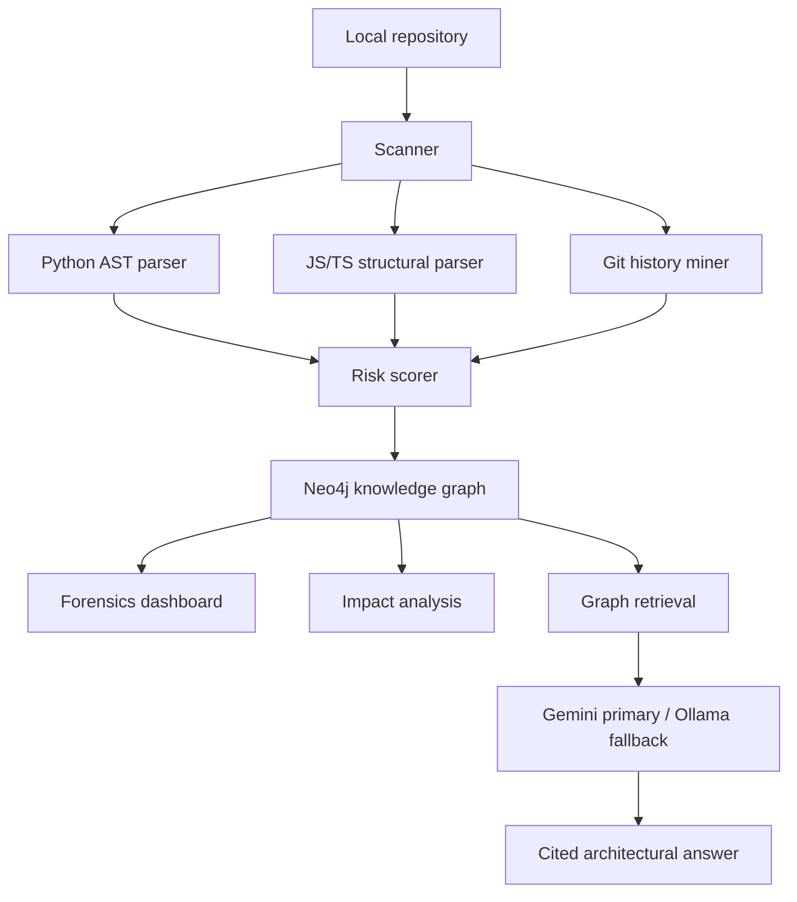

# Architecture

Codebase Cartographer is built around structural forensics: deterministic code structure first, AI synthesis second.

## Knowledge Graph

Core node types:

- `Repository`
- `File`
- `Symbol`
- `ExternalDependency`

Core relationships:

- `Repository CONTAINS File`
- `File DEFINES Symbol`
- `File IMPORTS File`
- `File DEPENDS_ON ExternalDependency`

## Risk Model

The initial load-bearing score combines:

- fan-in: how many files depend on a file
- complexity: branch-heavy code is harder to change safely
- churn: files changed frequently in Git history carry more uncertainty
- fan-out: files that know many dependencies can spread coupling

The score is explainable and intentionally deterministic. AI may describe the risk, but it does not invent the score.

## AI Strategy

Gemini is the primary reasoning layer for challenge alignment with Google AI tools. Ollama is a local fallback for free-first demos and private codebases.

No API key is stored in source control. External AI providers should be disabled when analyzing confidential repositories.

