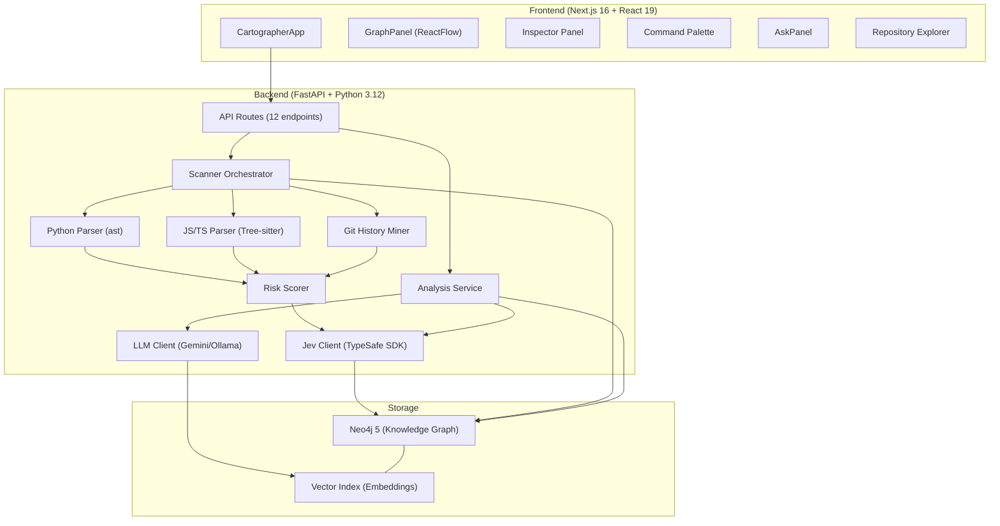
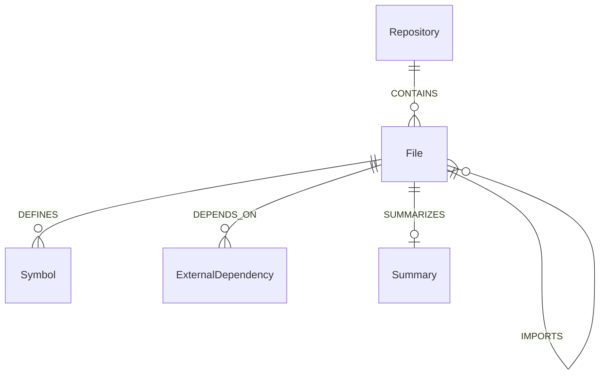
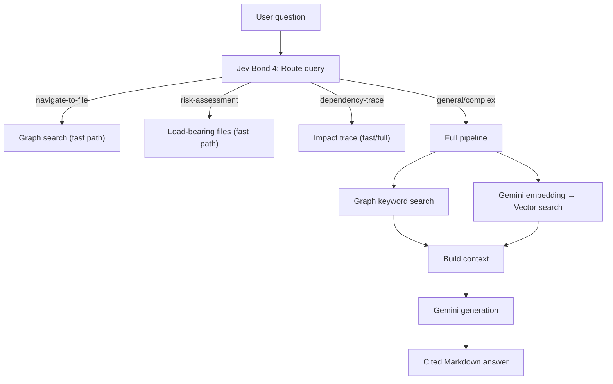
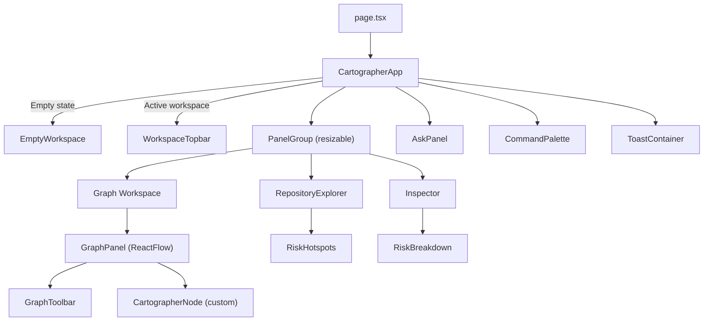

# Architecture

Codebase Cartographer is a three-tier application (Next.js frontend → FastAPI backend → Neo4j graph database) that performs structural forensics on source code repositories using a two-tier AI architecture.

---

## System Overview


```mermaid
flowchart TD
    subgraph Frontend ["Frontend (Next.js 16 + React 19)"]
        UI["CartographerApp"]
        GP["GraphPanel (ReactFlow)"]
        RI["Inspector Panel"]
        CP["Command Palette"]
        AP["AskPanel"]
        RE["Repository Explorer"]
    end

    subgraph Backend ["Backend (FastAPI + Python 3.12)"]
        API["API Routes (12 endpoints)"]
        SC["Scanner Orchestrator"]
        PP["Python Parser (ast)"]
        JP["JS/TS Parser (Tree-sitter)"]
        GH["Git History Miner"]
        RS["Risk Scorer"]
        AN["Analysis Service"]
        LLM["LLM Client (Gemini/Ollama)"]
        JEV["Jev Client (TypeSafe SDK)"]
    end

    subgraph Storage ["Storage"]
        N4J["Neo4j 5 (Knowledge Graph)"]
        VEC["Vector Index (Embeddings)"]
    end

    UI --> API
    API --> SC
    SC --> PP
    SC --> JP
    SC --> GH
    PP --> RS
    JP --> RS
    GH --> RS
    RS --> JEV
    JEV --> N4J
    SC --> N4J
    API --> AN
    AN --> N4J
    AN --> LLM
    AN --> JEV
    LLM --> VEC
    N4J --- VEC
```

---

## Knowledge Graph Schema

All repository data is stored in a Neo4j property graph. The schema uses five node types and five relationship types.

### Node Types

| Node | Key Property | Description |
|---|---|---|
| `Repository` | `root_path` (unique) | A scanned repository. Stores `name` and `indexed_at` timestamp. |
| `File` | `key` (unique, `{root_path}:{path}`) | A source file. Stores 20+ properties including LOC, complexity, churn, risk score, content hash, and all Jev-derived metadata (architectural role, framework, test detection, dead code, semantic risk). |
| `Symbol` | `id` (unique, `{root_path}:{file}:{name}:{line}`) | A function, class, or async function. Stores name, kind, signature, line range, and complexity. |
| `ExternalDependency` | `name` (unique) | An unresolved import target (third-party package). |
| `Summary` | `key` (unique, `{root_path}:{path}`) | An AI-generated file summary. Stores text, embedding vector, model, provider, and timestamp. |

### Relationships


```mermaid
erDiagram
    Repository ||--o{ File : CONTAINS
    File ||--o{ Symbol : DEFINES
    File ||--o{ File : IMPORTS
    File ||--o{ ExternalDependency : DEPENDS_ON
    File ||--o| Summary : SUMMARIZES
```

| Relationship | Source | Target | Properties |
|---|---|---|---|
| `CONTAINS` | Repository | File | — |
| `DEFINES` | File | Symbol | — |
| `IMPORTS` | File | File | `target` (original import string), `line_number`, `source` |
| `DEPENDS_ON` | File | ExternalDependency | — |
| `SUMMARIZES` | File | Summary | — |

### Indexes

| Index | Type | Purpose |
|---|---|---|
| `repo_path` | Uniqueness constraint | Repository identity |
| `file_key` | Uniqueness constraint | File identity |
| `symbol_id` | Uniqueness constraint | Symbol identity |
| `summary_key` | Uniqueness constraint | Summary identity |
| `file_score` | B-tree index | Fast risk-score ordering |
| `file_arch_role` | B-tree index | Architectural role queries |
| `file_risk` | B-tree index | Semantic risk score queries |
| `file_framework` | B-tree index | Framework filtering |
| `summary_embedding` | Vector index (cosine, 768-dim) | Semantic similarity search |

---

## Scan Pipeline

The scanner orchestrator (`scanner.py`) processes a repository in the following sequence:


```mermaid
flowchart LR
    A["1. Validate path"] --> B["2. Discover source files"]
    B --> C["3. Mine Git churn"]
    C --> D["4. Incremental cache check"]
    D --> E["5. Parse files (AST/Tree-sitter)"]
    E --> F["6. Resolve imports"]
    F --> G["7. Score load-bearing risk"]
    G --> H["8. Jev Bond 1: Classify files"]
    H --> I["9. Jev Bond 3: Detect tests"]
    I --> J["10. Jev Bond 8: Detect frameworks"]
    J --> K["11. Jev Bond 10: Detect dead code"]
    K --> L["12. Jev Bond 2: Enhance risk"]
    L --> M["13. Write to Neo4j"]
```

### Step Details

1. **Path Validation**: `validate_repo_path()` ensures the path exists, is a directory, and falls within `ALLOWED_REPO_ROOTS` (if configured).

2. **File Discovery**: `source_files()` recursively discovers `.py`, `.js`, `.jsx`, `.ts`, `.tsx` files, excluding standard ignored directories (`.git`, `node_modules`, `dist`, `build`, `__pycache__`, `.venv`, `.next`, etc.).

3. **Git Churn Mining**: `file_churn()` uses GitPython to traverse up to 500 commits, extracting per-file commit counts and last-modified timestamps.

4. **Incremental Cache**: For incremental scans, the scanner loads previous file data from Neo4j. Files matching both stat fingerprint (size + mtime) and content hash skip parsing entirely — their symbols and imports are reused.

5. **Parsing**:
   - **Python**: Uses the `ast` module to extract classes, functions (sync and async), imports, and from-imports. Computes cyclomatic complexity by counting branch nodes (`if`, `for`, `while`, `try`, `match`, `BoolOp`, `IfExp`, `ExceptHandler`).
   - **JavaScript/TypeScript**: Uses Tree-sitter (primary) with regex fallback. Extracts `import` statements, `require()` calls, function/arrow/class declarations. Computes complexity from `if`, `for`, `while`, `switch`, `catch`, `conditional_expression`, and `logical_expression` nodes.

6. **Import Resolution**: Builds module indexes for Python (dotted module paths with alias expansion) and JavaScript (extensionless stem matching with `/index` convention), then resolves every import edge to a concrete file path where possible.

7. **Risk Scoring**: Calculates a deterministic load-bearing score:
   ```
   score = 100 × (0.45 × fan_in_norm + 0.25 × complexity_norm + 0.20 × churn_norm + 0.10 × fan_out_norm)
   ```
   Fan-in is dampened by 0.3× for trivial files (< 30 LOC and complexity ≤ 1) to prevent simple re-exports from outranking genuinely complex modules.

8. **Jev Classification (Bond 1)**: Every file is classified into one of 40+ architectural roles (e.g., `core-business-logic`, `api-endpoint-handler`, `ui-component`, `test-unit`). Jev receives the file path, language, LOC, complexity, fan-in/out, symbols, imports, external deps, and a 2,000-char source snippet.

9. **Jev Test Detection (Bond 3)**: Probabilistic detection of test/spec/fixture files. Files with `is_test_probability > 0.6` are flagged. Jev also categorizes the test type (unit, integration, e2e, fixture, helper, config, mock).

10. **Jev Framework Detection (Bond 8)**: Identifies the framework ecosystem (40+ options: React, Next.js, FastAPI, Django, etc.) and architectural layer (presentation, api, domain, infrastructure, etc.).

11. **Jev Dead Code Detection (Bond 10)**: Only candidates with zero fan-in are evaluated. Files with `is_dead_code_probability > 0.65` are flagged. Jev categorizes the dead code (abandoned feature, stale migration, orphaned test, etc.).

12. **Jev Semantic Risk Enhancement (Bond 2)**: Files with deterministic score > 20 receive a semantic risk evaluation. The final score blends 70% deterministic + 30% Jev semantic (normalized from Jev's 1–10 scale to 0–100).

13. **Neo4j Write**: The entire graph (files, symbols, imports, external deps) is written in batched `UNWIND` Cypher statements (`WRITE_BATCH_SIZE = 250`). Stale files, symbols, and orphaned external dependencies are deleted.

---

## Two-Tier AI Strategy

### System One: TypeSafe Jev

The `JevClient` (`jev_client.py`) wraps the `typesafe-sdk` `AsyncTypeSafeClient`. Each call sends a structured `state` dictionary and a `questions` dictionary to the Jev API. Responses are parsed into `JevDecision` objects with typed fields (`answer`, `probability`, `value`, `confidence`, `distribution`).

All 10 bonds share the same `decide()` method:

```python
async def decide(state, questions, timeout=10.0) -> JevResult | None
```

Jev is gated by a master kill-switch (`JEV_ENABLED`) and a missing API key check. All scan-time bonds run with configurable concurrency (`JEV_BATCH_CONCURRENCY`, default 5) via `asyncio.Semaphore`.

### System Two: Gemini / Ollama

The `LLMClient` (`llm.py`) provides two operations:

- **`complete(prompt)`**: Text generation with automatic rate-limit retry (5 attempts with 5s backoff for 429 errors). Provider cascade: Gemini → Ollama → deterministic fallback.
- **`embed(text, task)`**: Embedding generation for semantic search. Provider cascade: Gemini (`text-embedding-004`) → Ollama (`nomic-embed-text`) → empty vector.

The deterministic fallback returns a structured message with the raw prompt context, allowing the user to continue analysis without any AI provider.

---

## Query & Analysis Pipeline

### Architecture Questions (`/api/query`)


```mermaid
flowchart TD
    Q["User question"] --> R["Jev Bond 4: Route query"]
    R -->|"navigate-to-file"| FS["Graph search (fast path)"]
    R -->|"risk-assessment"| LB["Load-bearing files (fast path)"]
    R -->|"dependency-trace"| DT["Impact trace (fast/full)"]
    R -->|"general/complex"| FP["Full pipeline"]
    FP --> GS["Graph keyword search"]
    FP --> SS["Gemini embedding → Vector search"]
    GS --> CTX["Build context"]
    SS --> CTX
    CTX --> GEN["Gemini generation"]
    GEN --> ANS["Cited Markdown answer"]
```

Jev Bond 4 classifies the user's intent into one of 13 categories and estimates whether generative AI is needed. Simple queries (file navigation, symbol lookup, risk assessment) are answered directly from graph data without an LLM call.

### Impact Analysis (`/api/impact`)

1. **Graph traversal**: Direct and transitive dependents are discovered via variable-depth Cypher path queries (depth 1–6, limit 100 results).
2. **Jev Bond 6**: Evaluates refactor safety — probability of safe single-PR refactor, recommended strategy (8 options from "safe-direct-refactor" to "do-not-refactor-too-risky"), and blast radius score (1–10).
3. **Gemini narrative**: A detailed Markdown explanation of the change impact.

### Summary Generation (`/api/summaries`)

1. **Jev Bond 7**: Triages every file to decide if it warrants an LLM call. Files triaged out (probability < 0.5) are skipped. Remaining files are sorted by Jev-assigned priority (descending).
2. **Jev Bond 9**: For files with existing summaries, evaluates whether the summary is stale. Files with `needs_resummarize` probability < 0.4 are skipped.
3. **Gemini summarization**: Source snippets (up to `SUMMARY_MAX_CHARS`, default 4,000) are sent to Gemini with a structured prompt.
4. **Embedding**: Each summary is embedded with Gemini and stored in the Neo4j vector index.

---

## Persistence & Graph Operations

### Write Strategy

Repository graphs are atomically written within a single Neo4j transaction:

1. `MERGE` the Repository node.
2. `UNWIND` + `MERGE` all File nodes in batches of 250.
3. Delete stale File nodes (and their Symbols/Summaries) that no longer exist.
4. Delete all existing IMPORTS and DEPENDS_ON edges (full refresh).
5. Delete and recreate all Symbol nodes.
6. `UNWIND` + `MERGE` IMPORTS edges (resolved internal imports).
7. `UNWIND` + `MERGE` DEPENDS_ON edges (unresolved external deps).
8. Clean up orphaned ExternalDependency nodes.

### Graph Slice (`/api/graph`)

The graph view returns the top-N files by risk score (default 80, max 400) with their import edges (default 200, max 2,000). It also computes:

- **Directory clusters**: Top-level directory groupings with file count, average score, and max score.
- **Cluster edge counts**: Internal, external-in, and external-out edge counts per cluster.
- **Jev Bond 5**: Rates each cluster's cohesion (1–5), coupling (1–5), and extraction readiness.
- **Truncation metadata**: The client is told whether the graph was truncated and the applied limits.

### Semantic Search

File summaries with non-null embeddings are indexed in a Neo4j vector index (`summary_embedding`, cosine similarity, 768 dimensions). The `/api/query` endpoint embeds the user's question and retrieves the top-6 most semantically similar summaries.

### Scan Cache

For incremental rescans, `scan_cache()` loads the complete previous state from Neo4j: all File nodes with their full property set, all Symbols, and all import/dependency edges. This allows the scanner to skip unchanged files entirely.

---

## Frontend Architecture

### Component Hierarchy


```mermaid
flowchart TD
    Page["page.tsx"] --> CA["CartographerApp"]
    CA -->|"Empty state"| EW["EmptyWorkspace"]
    CA -->|"Active workspace"| WT["WorkspaceTopbar"]
    CA --> PG["PanelGroup (resizable)"]
    PG --> RE["RepositoryExplorer"]
    PG --> GPW["Graph Workspace"]
    PG --> INS["Inspector"]
    GPW --> GP["GraphPanel (ReactFlow)"]
    GP --> GT["GraphToolbar"]
    GP --> CN["CartographerNode (custom)"]
    CA --> AP["AskPanel"]
    CA --> CP["CommandPalette"]
    CA --> TC["ToastContainer"]
    RE --> RH["RiskHotspots"]
    INS --> RB["RiskBreakdown"]
```

### State Management

All workspace state is managed locally in `CartographerApp` via React hooks — no external state library. The core state atoms:

| State | Type | Purpose |
|---|---|---|
| `activeRepoPath` | `string` | Currently active repository |
| `selectedFile` | `string \| null` | Selected file path (syncs graph ↔ tree ↔ inspector) |
| `fileDetail` | `FileDetail \| null` | Full detail for the selected file |
| `graph` | `GraphData` | Current graph slice (nodes, edges, clusters) |
| `files` | `Array` | Flat file list for the tree view |
| `repositories` | `RepositoryInfo[]` | All indexed repositories |
| `overview` | `{files, symbols, avg_score}` | Repository statistics |
| `graphMode` | `"architecture" \| "risk" \| "recent"` | Active view mode |
| `impactMode` / `impactData` | `boolean` / `any` | Impact analysis state |
| `question` / `answer` / `semanticMatches` | `string` / `string` / `SemanticMatch[]` | AI Q&A state |

### Key Interactions

- **Universal File Selection**: `selectFile(path, source)` handles selection from any source (graph click, tree click, search result, AI evidence, inspector link). It sets the selected file and fetches full detail from `/api/file-detail`.
- **Graph Rendering**: `GraphPanel` converts raw API nodes into ReactFlow nodes using Dagre for layout. Custom `CartographerNode` components display file name, parent directory, language, LOC, framework, and risk indicators.
- **Graph Filters**: The `GraphToolbar` provides toggles for hiding test files, showing high-risk only, and hiding isolated nodes. Filters are applied client-side over the graph slice.
- **Command Palette**: `Cmd+K` opens a modal with debounced search (300ms). Results show file matches from `/api/search`. The first option always forwards the query to "Ask Cartographer".

### API Client

The typed API client (`api.ts`) provides:

- Typed interfaces for all API responses (`GraphData`, `FileDetail`, `Overview`, `AskResponse`, etc.).
- A private `request()` function that prepends `NEXT_PUBLIC_API_BASE`, attaches the optional `NEXT_PUBLIC_API_TOKEN` header, and handles errors.
- Helper functions for query string construction (`withRepoPath`, `withQuery`).

---

## API Security Model

| Mechanism | Configuration | Behavior |
|---|---|---|
| **API Token** | `API_TOKEN` env var | When set, all endpoints require `Authorization: Bearer <token>` or `X-API-Key: <token>`. When unset, all endpoints are open. |
| **Rate Limiting** | `SCAN_RATE_LIMIT_PER_MINUTE` (default 6) | Per-client sliding-window rate limit on `/api/scan` and `/api/summaries`. |
| **File Cap** | `SCAN_MAX_FILES` (default 10,000) | Rejects repositories exceeding the file limit. |
| **Path Allowlist** | `ALLOWED_REPO_ROOTS` | Comma-separated list of allowed scan roots. When empty, all paths are allowed. |
| **CORS** | `CORS_ORIGINS` (default `http://localhost:5173`) | Configurable origins. Only `GET` and `POST` methods. Only `Authorization`, `Content-Type`, and `X-API-Key` headers. No credentials. |

---

## Configuration Reference

All configuration is managed via Pydantic Settings, loaded from `.env` files with environment variable overrides.

| Variable | Default | Description |
|---|---|---|
| `LLM_PROVIDER` | `gemini` | Primary LLM provider (`gemini` or `ollama`) |
| `FALLBACK_LLM_PROVIDER` | `ollama` | Fallback LLM provider |
| `GEMINI_API_KEY` | — | Google Gemini API key |
| `GEMINI_MODEL` | `gemini-1.5-flash` | Gemini model for text generation |
| `OLLAMA_BASE_URL` | `http://localhost:11434` | Ollama server URL |
| `OLLAMA_MODEL` | `qwen2.5-coder:7b` | Ollama model for text generation |
| `TYPESAFE_API_KEY` | — | TypeSafe API key (enables Jev) |
| `JEV_BASE_URL` | `https://api.typesafe.ai` | Jev API endpoint |
| `JEV_MODEL` | `jev-latest` | Jev model version |
| `JEV_ENABLED` | `true` | Master kill-switch for all Jev features |
| `JEV_BATCH_CONCURRENCY` | `5` | Max parallel Jev calls during scan |
| `EMBEDDING_PROVIDER` | `gemini` | Primary embedding provider |
| `FALLBACK_EMBEDDING_PROVIDER` | `ollama` | Fallback embedding provider |
| `GEMINI_EMBEDDING_MODEL` | `text-embedding-004` | Gemini embedding model |
| `OLLAMA_EMBEDDING_MODEL` | `nomic-embed-text` | Ollama embedding model |
| `EMBEDDING_DIMENSIONS` | `768` | Vector index dimensions |
| `SUMMARY_MAX_FILES` | `120` | Max files to summarize per request |
| `SUMMARY_MAX_CHARS` | `4000` | Max source chars sent to LLM per file |
| `SCAN_MAX_FILES` | `10000` | Max source files per repository |
| `SCAN_RATE_LIMIT_PER_MINUTE` | `6` | Rate limit for scan/summary endpoints |
| `API_TOKEN` | — | Optional API authentication token |
| `NEO4J_URI` | `bolt://localhost:7687` | Neo4j connection URI |
| `NEO4J_USERNAME` | `neo4j` | Neo4j username |
| `NEO4J_PASSWORD` | — | Neo4j password |
| `ALLOWED_REPO_ROOTS` | — | Comma-separated allowed scan paths |
| `CORS_ORIGINS` | `http://localhost:5173` | Comma-separated allowed CORS origins |
