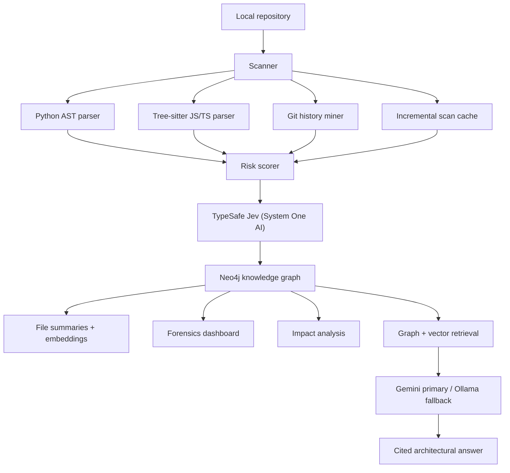

# Architecture

Codebase Cartographer is built around structural forensics: deterministic code structure combined with two distinct layers of AI analysis.

```mermaid
flowchart TD
    A["Local repository"] --> B["Scanner"]
    B --> C["Python AST parser"]
    B --> D["Tree-sitter JS/TS parser"]
    B --> E["Git history miner"]
    B --> N["Incremental scan cache"]
    C --> F["Risk scorer"]
    D --> F
    E --> F
    N --> F
    F --> O["TypeSafe Jev (System One AI)"]
    O --> G["Neo4j knowledge graph"]
    G --> H["File summaries + embeddings"]
    G --> I["Forensics dashboard"]
    G --> J["Impact analysis"]
    G --> K["Graph + vector retrieval"]
    K --> L["Gemini primary / Ollama fallback"]
    L --> M["Cited architectural answer"]
```

## Knowledge Graph

Core node types:

- `Repository`
- `File`
- `Symbol`
- `ExternalDependency`
- `Summary`

Core relationships:

- `Repository CONTAINS File`
- `File DEFINES Symbol`
- `File IMPORTS File`
- `File DEPENDS_ON ExternalDependency`
- `File SUMMARIZES Summary`

## Risk Model

The initial load-bearing score combines deterministic metrics:

- fan-in: how many files depend on a file (dampened for trivial utility files to prevent simple re-exports from outranking complex modules)
- complexity: branch-heavy code is harder to change safely
- churn: files changed frequently in Git history carry more uncertainty
- fan-out: files that know many dependencies can spread coupling

**Semantic Enhancement (TypeSafe Jev):**
After deterministic scoring, high-load-bearing files are passed to our TypeSafe Jev System One integration. Jev evaluates the structural role, domain logic, and likelihood of the file acting as a critical chokepoint or security vulnerability. The final risk score is a blended composite: 70% deterministic metrics and 30% Jev semantic risk.

## Two-Tier AI Strategy

Cartographer employs a dual-tier AI architecture to balance speed, structured outputs, and deep reasoning:

1. **System One (TypeSafe AI Jev):**
   Integrated via the official `typesafe-sdk`, Jev acts as the fast, structured decision engine. It is utilized across the entire lifecycle through 10 distinct "Integration Bonds." During indexing, it detects test files, dead code, and frameworks, while also computing semantic risk. During retrieval and summarization, it acts as a smart gateway: routing user queries, evaluating refactor safety, and triaging which files actually need expensive Gemini summaries.
   
2. **System Two (Google Gemini / Ollama):**
   Gemini serves as the primary deep-reasoning layer. When summaries are enabled, Cartographer sends truncated source snippets (default: 4,000 characters per file) to Gemini to generate natural-language architectural summaries and compute high-dimensional embeddings (`text-embedding-004`). 

**Fallback Cascade:**
If the primary provider (Gemini) fails or rate-limits, the system gracefully falls back to a local Ollama instance (`qwen2.5-coder:7b`) for offline use and private codebases. If both LLM services are unavailable, Cartographer provides a deterministic offline fallback using structural Neo4j retrieval. No API key is stored in source control.

## Persistence

Repository graphs are written to Neo4j in batched `UNWIND` statements. File nodes include size, mtime, and SHA-256 content fingerprints. On incremental rescans, unchanged files reuse their previous symbols and import edges from Neo4j; changed files are reparsed and the repository-level score is recomputed across the full graph. Removed files are deleted during upsert.

The architecture graph view returns the highest load-bearing files first, with a hard cap (400 nodes / 2,000 edges) so the UI stays usable on large repositories. Truncation is reported to the client, along with top-level directory clusters that provide level-of-detail context for the hidden remainder. Furthermore, the frontend implements interactive graph filters (e.g., hiding test files, displaying only high-risk components, removing isolated nodes) directly over this truncated layout to help users distill complex architecture maps efficiently.

## API Guardrails

Local development stays open by default. For hosted or shared deployments, set `API_TOKEN` to require either a bearer token or `X-API-Key` on API requests. Expensive scan and summary endpoints are also protected by `SCAN_MAX_FILES` and `SCAN_RATE_LIMIT_PER_MINUTE`.
